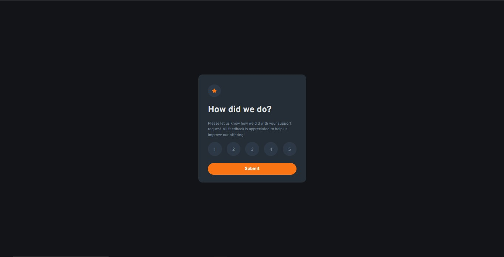

# Getting Started with Vite

## Available Scripts

In the project directory, you can run:

### `npm run dev`

To build

### `npm run build`

# Frontend Mentor - Interactive rating component solution

This is a solution to the [Interactive rating component challenge on Frontend Mentor](https://www.frontendmentor.io/challenges/interactive-rating-component-koxpeBUmI). Frontend Mentor challenges help you improve your coding skills by building realistic projects. 

## Table of contents

## Table of contents

- [Overview](#overview)
  - [The challenge](#the-challenge)
  - [Screenshot](#screenshot)
  - [Links](#links)
- [My process](#my-process)
  - [Built with](#built-with)
  - [Useful resources](#useful-resources)
- [Author](#author)

## Overview

### The challenge

Users should be able to:

- View the optimal layout depending on their device's screen size
- See hover and focus states for interactive elements

### Screenshot

### Links

- Solution URL: [Repos](https://github.com/legonnexon/interactive-rating-components-vite/)
- Live Site URL: [URL Site](https://legonnexon.github.io/interactive-rating-components-vite/)

## My process

### Built with

- Semantic HTML5 markup
- CSS custom properties
- Flexbox
- CSS Grid
- Mobile-first workflow
- [React](https://reactjs.org/) - JS library
- [Styled Components](https://styled-components.com/) - For styles

If you want see more click [here](https://www.frontendmentor.io/challenges/product-preview-card-component-GO7UmttRfa)

### Useful resources

- [Tailwind Docs](https://styled-components.com/docs/basics#installation)
- [Stack Overflow](https://stackoverflow.com/)

## Author

- Website - [Joao Barcellos](https://www.github.com/legonnexon/)
- Frontend Mentor - [@legonnexon](https://www.frontendmentor.io/profile/legonnexon)
